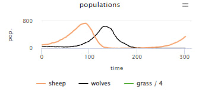
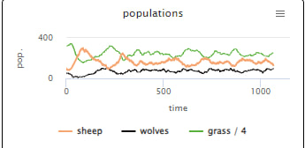

## Комп'ютерні системи імітаційного моделювання
## СПм-22-11, **Шаманов Дмитро Олегович**
### Лабораторна робота №**1**. Опис імітаційних моделей та проведення обчислювальних експериментів

 

### Варіант 22(7), модель у середовищі NetLogo:
[Wolf Sheep Predation](https://www.netlogoweb.org/launch#http://www.netlogoweb.org/assets/modelslib/Sample%20Models/Biology/Wolf%20Sheep%20Predation.nlogo)

 

### Вербальний опис моделі:
Ця модель досліджує стабільність екосистем хижак-жертва. Така система називається нестабільною, якщо вона має тенденцію призводити до вимирання одного або кількох видів. Навпаки, система є стабільною, якщо вона прагне підтримувати себе протягом тривалого часу, незважаючи на коливання чисельності населення.

### Керуючі параметри:
- **initial-numbers-of-sheep** визначає початкову кількість овець
- **initial-numbers-of-wolves** визначає початкову кількість вовків
- **grass-regrowth-time** визначає час для зростання трави

### Внутрішні параметри:
- **energy**. енергія, параметр, через який виконується розмноження волків і овець.

### Показники роботи системи:
- популяція овець у даний момент.
- популяція вовків у даний момент.
- популяція трави у даний момент.

### Примітки:
При налаштуваннях керуючих параметрів за замовчуванням, вовки розмножуються занадто швидше ніж вівці.

### Недоліки моделі:
Вовки беруть одну ціль, і гоняться за нею, при умові що ближче є інші цілі.

 

## Обчислювальні експерименти

### 1. Вплив значень популяції овець та вовків на їх розмноження
Досліджується відношення популяції овець та вовків у версії моделі "sheeps-wolves".
Експерименти проводяться при налаштуваннях за замовчуванням, протягом 300 тактів. Початкова кількість овець - 100, кількість вовків - 50.

<table>
<thead>
<tr><th>Кількість тактів</th><th>Кількість овець</th><th>Кількість вовків</th></tr>
</thead>
<tbody>
<tr><td>0</td><td>100</td><td>50</td></tr>
<tr><td>50</td><td>320</td><td>42</td></tr>
<tr><td>100</td><td>630</td><td>219</td></tr>
<tr><td>150</td><td>2</td><td>481</td></tr>
<tr><td>200</td><td>8</td><td>16</td></tr>
<tr><td>250</td><td>43</td><td>0</td></tr>
<tr><td>300</td><td>346</td><td>0</td></tr>
</tbody>
</table>

Графік наочно показує, що при збільшені популяції овець, різко збільшується популяція вовків. Але при цьому, при збільшені популяції вовків, зменшується популяція овець, що приводить до вимирання і вовків і овець. У випадку, якщо вимруть всі вовки, популяція овець буде неконтрольовано рости. У випадку якщо вимруть всі вівці, вимруть і вовки, бо не буде їжі.

Досліджується відношення популяції овець та вовків у версії моделі "sheeps-wolves-grass".
Експерименти проводяться при налаштуваннях за замовчуванням, протягом 500 тактів. Початкова кількість овець - 100, кількість вовків - 50, час виростання трави - 30.

<table>
<thead>
<tr><th>Кількість тактів</th><th>Кількість овець</th><th>Кількість вовків</th><th>Кількість трави</th></tr>
</thead>
<tbody>
<tr><td>0</td><td>100</td><td>50</td><td>321</td></tr>
<tr><td>50</td><td>190</td><td>20</td><td>226</td></tr>
<tr><td>100</td><td>284</td><td>28</td><td>167</td></tr>
<tr><td>150</td><td>186</td><td>61</td><td>212</td></tr>
<tr><td>200</td><td>129</td><td>93</td><td>274</td></tr>
<tr><td>250</td><td>130</td><td>64</td><td>284</td></tr>
<tr><td>300</td><td>219</td><td>50</td><td>184</td></tr>
<tr><td>300</td><td>136</td><td>90</td><td>251</td></tr>
<tr><td>300</td><td>150<td><td>80</td><td>252</td></tr>
<tr><td>300</td><td>137</td><td>84</td><td>250</td></tr>
<tr><td>300</td><td>161</td><td>98</td><td>231</td></tr>
</tbody>
</table>

Графік наочно показує різкий стрибок популяції овець, але через наявність такого фактора як трава, ця популяція не виросла занадто швидко, тож протягом часу уся система трималась приблизно в одному балансі.
