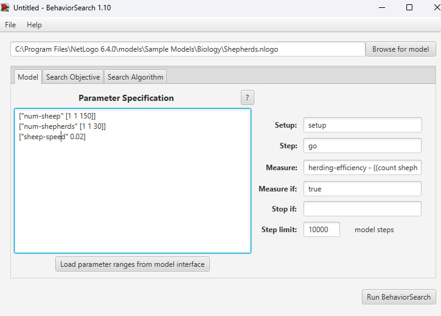
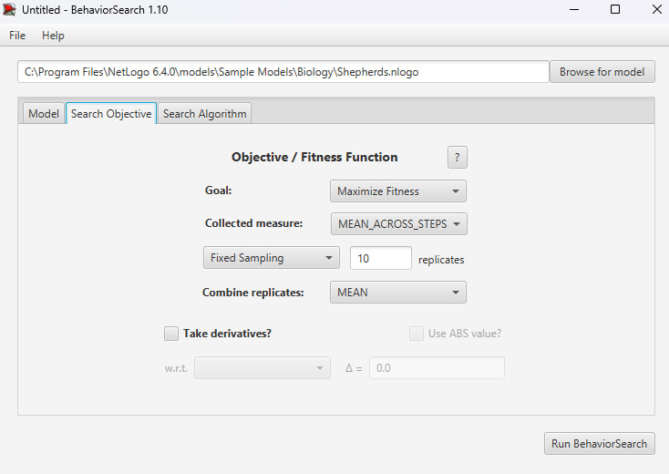
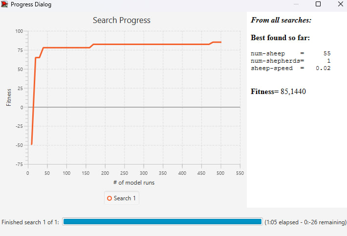

## Комп'ютерні системи імітаційного моделювання
## СПм-22-4, **Шаманов Дмитро**
### Лабораторна робота №**3**. Використання засобів обчислювального интелекту для оптимізації імітаційних моделей

 

### Варіант 22(9), модель у середовищі NetLogo:

[Shepherds](http://www.netlogoweb.org/launch#http://www.netlogoweb.org/assets/modelslib/Sample%20Models/Biology/Shepherds.nlogo)

 

### Налаштування середовища BehaviorSearch:

**Обрана модель**:
<pre>
C:\Program Files\NetLogo 6.3.0\models\Sample Models\Biology\Shepherds.nlogo
</pre>
**Параметри моделі** (вкладка Model):  

<pre>
["num-sheep" [1 1 150]]
["num-shepherds" [1 1 30]]
["sheep-speed" 0.02]
</pre>
Sheep-speed було встановлена в значення 0.02. Адже не залежно від інших параматрів найкращим значенням для sheep-speed завжди є нуль. Тому немає сенсу вести пошук оптимального значення для цього параметру і було обрано значення за замовчуванням 0.02, коли у овець є хоч якась швидкість.
  
Використовувана **міра**:  
Для фітнес-функції  було обрано **ефективність випасання** враховуючи співвідношення пастухів та овець.

<pre>
  herding-efficiency - ((count shepherds * 100) / (count sheep))
</pre>

Ефективність випасання пастухами повинна враховуватися **в середньому** за весь період симуляції тривалістю 10 000 тактів (адже на кожному такті є своє значення ефективності випасання), починаючи з 0 такту симуляції.  

Параметр зупинки за умовою ("**Stop if**") не використовувався.  
Загальний вигляд вкладки налаштувань параметрів моделі:  

**Налаштування цільової функції** (вкладка Search Objective):  
Метою вибору параметрів для показника **herding-efficiency** є **максимізація** ефективності управління стадом - це вказано через параметр "**Goal**" зі значенням **Maximize Fitness**. Іншими словами, завданням є знаходження таких параметрів, за яких досягається найвища ефективність у веденні отари. При цьому цікавить результат не у якийсь окремий момент симуляції, а середнє її значення за всю симуляцію (тривалість якої (10 000 кроків) вказувалася на минулій вкладці). Для цього у параметрі "**Collected measure**", що визначає спосіб обліку значень обраного показника, вказано **MEAN_ACROSS_STEPS**.  
Щоб уникнути викривлення результатів через випадкові значення, що використовуються в логіці самої імітаційної моделі, **кожна симуляція повторюється по 10 разів**, результуюче значення розраховується як **середнє арифметичне**.
Загальний вигляд вкладки налаштувань цільової функції:  

**Налаштування алгоритму пошуку** (вкладка Search Algorithm):  

Загальний вид вкладки налаштувань алгоритму пошуку:  

 

### Результати використання BehaviorSearch:
Результат пошуку параметрів імітаційної моделі, використовуючи **генетичний алгоритм**:  

